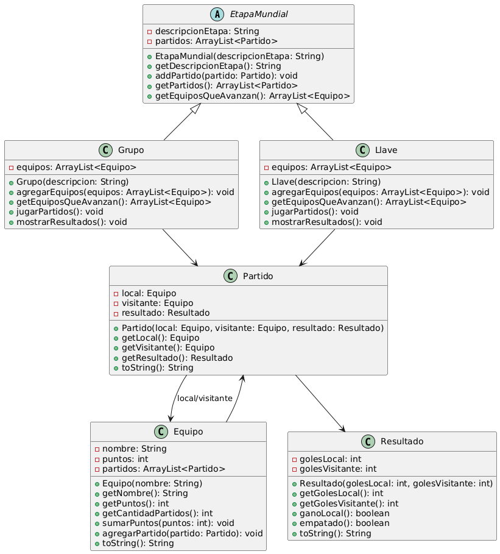

# Mundialito - Simulación de Mundial en Java

Este proyecto simula un torneo estilo Mundial con 8 grupos, fase de eliminación y final.

Final Programación Orientada a Objetos

## Diagrama de Clases

